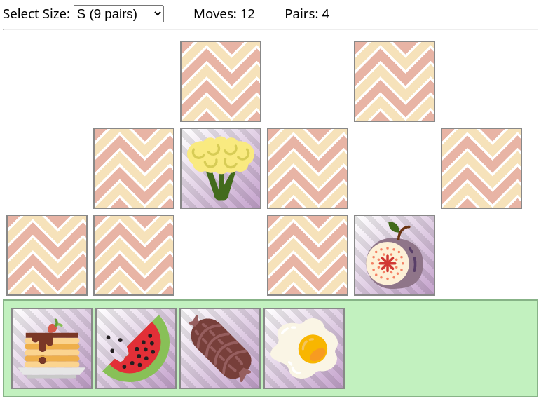

# Memory

This project is a simple implementation of the board game Memory.
You can play it anytime at <https://eisenwave.github.io/memory/> or by
downloading this repository and opening `index.html`.

## Gameplay

The goal of the game is to find all matching pairs of items in as few moves as
possible.
After choosing a board size, you can play the game by clicking on cards:

- the first click uncovers one card
- the second click uncovers another card
- the third click on any card hides the two uncovered cards
    - if the cards match, they are moved to the stash
    - the game is over when no cards are left on the board
